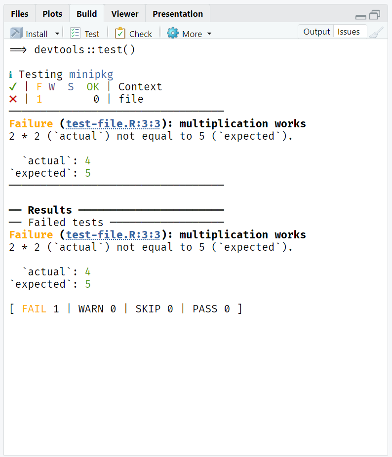
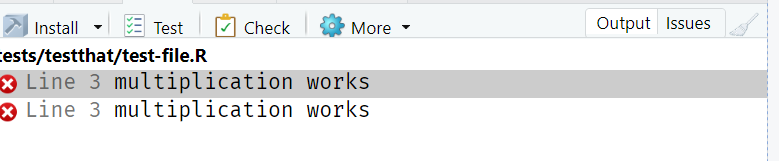

# minipkg

The goal of minipkg is to showcase a little issue

## Steps to reproduce

1.  Clone locally
2.  Run tests with testthat (Ctrl / Cmd + Shift + T)
   
4.  Go to Issues in the Build Pane

Notice that the marker to failed test is recorded twice. This is caused by the fact that testthat gives failures as it goes, and gives a summary at the end. I wonder if RStudio could work around this, by only displaying unique occurences of markers

